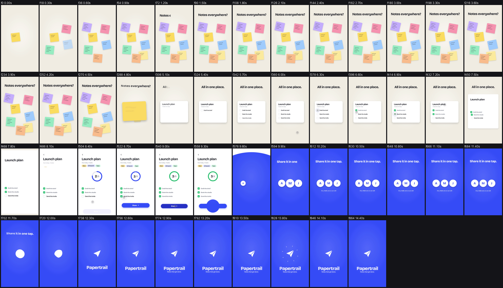

# Motioner

An Agent Skill (Claude Code and Codex) for making motion graphics and product videos where three things are right: **smooth animation**, **seamless morph transitions**, and **sound effects and music on the exact frame**. Remotion is the default tool.

It is not just advice. It ships:

- **A Remotion kit** (`templates/remotion/`): curves by role, hitch-free keyframe tracks, OKLab colour mixing, a `MorphCarrier` that enforces the source/carrier/target contract (no double cards, no ghost text), path and letter morphs, flood, zoom-through and whip-pan transitions, directional motion blur, sharp close-ups, and a build pipeline.
- **Review tools** (`scripts/`) that measure the encoded video and audio:

| Script | What it does |
|---|---|
| `transition_review.py` | Per-transition contact sheets with speed/contrast/sharpness curves and flags: POP, STUTTER, HITCH, FLASH, BLANK, COLORJUMP, GHOST, MUDDY, SOFT, plus local ones on a fine grid: HANDOFF-JUMP (something small jumps on a morph's first/last frame), TELEPORT, JERK (still to full speed in one frame), with pixel positions; lists the fastest frame of every move (where whoosh peaks go) |
| `contact_sheet.py` | Whole-film thumbnails at phone size for a muted review, or `--crop` close-ups of one region frame by frame |
| `sfx_scan.py` | Screens SFX candidates: shape, lead-in, attack, peak, length vs the move, noise; verdict per role; spectrogram cards |
| `beat_grid.py` | Tempo, beats, bars, phrases, accents, breaks and the song's final hit in video frames |
| `build_mix.py` | Cue sheet to mastered WAV: placement by attack/peak/end/peakcut, bar-line music edits, ducking, music kept ~9 LU under the mix, true-peak-safe mastering without crushed transients |
| `sync_check.py` | Finds every cue in the delivered MP4 by cross-correlation and reports early/late in ms and frames |
| `verify_video.py` | Size, fps, exact frame count, codec, pixel format, audio length |

- **Reference docs** (`references/`): morph recipes and a glitch catalogue (symptom, cause, fix), motion craft, sound design with working asset sources, review loop, Remotion setup, typography, direction defaults.
- **A worked example** (`examples/papertrail/`): a 14.5 s film that uses every transition type, with its review sheets and the list of glitches the tools caught and how they were fixed.



## Install

Copy the whole folder (with `references/`, `scripts/`, `templates/`):

| Agent | Personal | Per repository |
|---|---|---|
| Claude Code | `~/.claude/skills/motioner/` | `.claude/skills/motioner/` |
| Codex | `~/.codex/skills/motioner/` | `.agents/skills/motioner/` |

```
git clone https://github.com/Tarquished/motioner ~/.claude/skills/motioner
pip install numpy scipy pillow opencv-python librosa
```

FFmpeg/FFprobe: the scripts use the ones on PATH, `MOTIONER_FFMPEG`/`MOTIONER_FFPROBE`, or the copies Remotion installs in `node_modules/@remotion/compositor-*`.

Invoke with `/motioner` (Claude Code) or `$motioner` (Codex), or let the description trigger it for video work.

## Quick use of the tools

```
python scripts/transition_review.py out/film.mp4 --plan transitions.json --out out/review
python scripts/sfx_scan.py research/sfx/*.mp3 --role whoosh --motion-frames 36 --fps 60 --cards out/sfx-cards
python scripts/beat_grid.py music.mp3 --fps 60 --png out/grid.png --json out/grid.json
python scripts/build_mix.py audio/cues.json --out public/audio/mix.wav --root .
python scripts/sync_check.py out/film.mp4 public/audio/mix.cues.json --root .
python scripts/verify_video.py out/film.mp4 --width 1080 --height 1920 --fps 60 --frames 873 --codec h264 --pixel-format yuv420p --require-audio
```

## Testing the skill

Run `evals/evals.json` prompts in a fresh session and score the MP4 with `evals/review-scorecard.md`. Eval 2 (fix a glitching film) and the Papertrail example are the regression checks for morph quality and SFX sync.

## Limits

The tools measure; they do not have taste. Flags point at frames to look at, and the agent must look. Agents usually cannot hear audio: the skill makes them say so, rely on measurements (shape, alignment, sync, levels) and hand over stems and previews for a human listen.

MIT licence. The repository contains no third-party media; the example downloads its sounds from Mixkit and Kenney at setup.
