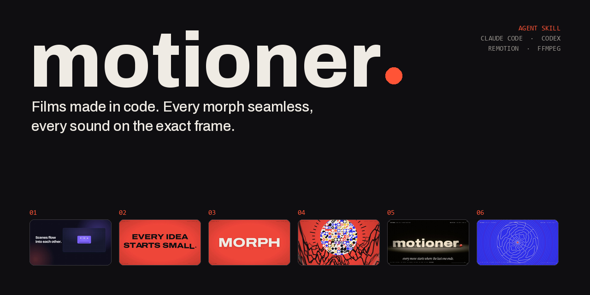

<div align="center">



<br>

[](https://github.com/Tarquished/motioner/stargazers)
[](LICENSE)


**[Watch the films](#watch-the-films)** · **[Install](#install)** · **[What is inside](#what-is-inside)** · **[How it works](#how-it-works)** · **[Star it](#-if-this-helped-you)**

</div>

---

**Motioner** is an Agent Skill for [Claude Code](https://claude.com/claude-code) and Codex that makes motion graphics, reels and product films at the level of the best films made in code. It is not a template pack. It is a way of working, plus the kit and the measuring tools to prove the result:

| | |
|---|---|
| **A creative concept** | One seed object that transforms through every scene. Chapters of one visible verb each, chosen on the beat. Type that acts out its own words. A bookend: the film ends where it started. |
| **Smooth animation** | Curves chosen by role. No velocity breaks, nothing frozen while the eye reads it. |
| **Seamless morphs** | One carrier object crosses every boundary. Source, carrier and target are never on screen at the same time. No plain cuts, no crossfades. |
| **Sound on the frame** | Music and sound effects **written in code** for this film, on its beat grid: a whoosh shaped like the move, a riser that peaks on the reveal, a silence before the drop. Sync is proven in the delivered MP4. |

Remotion is the default tool. Nothing counts as finished until the **encoded file** has been measured and looked at.

## Watch the films

Every frame and every sound of these six films was written in code by an agent using this skill. Press play, no download needed (previews are 720p; each one links to the full 1080p 60 fps file).

### 06 · Resonance &nbsp;<sub>30 s · 2560x1440 · 60 fps · no 3D</sub>

Sound made visible. One shader draws the whole film: everything is a distance field, so a ring can travel along a dot, then along a word. A dot pings and the room turns to paper; time runs backwards and the rings **rewind onto the word SOUND**; it melts letter by letter into MOTION; the camera falls into the counter of the O and comes out inside the film's **own waveform**, which zooms out to the whole 30 seconds, bends into a ring and opens like a lens onto a **plate of sand** where every note of the arpeggio is a different Chladni pattern. The plate goes out of register into a **colour separation** (three additive plates that lock on the note), a window opens, and **the name is built out of the film itself**: each world you just saw shrinks on a beat into one letter of *motioner.*, the rectangle morphing into the glyph's outline. The letters live on their notes, a click locks the name, the sand is pulled onto its outline, and the seed drops in as the full stop. A code-written score with booms, choir and time-reversed sound.

https://github.com/user-attachments/assets/205e8f96-8cfb-48bd-8645-ace5dfa97f20

[Full quality 1440p60 MP4](videos/06-motioner-reel06-resonance.mp4)

Source: [`examples/reel06-resonance`](examples/reel06-resonance) · technique: [`references/field-technique.md`](references/field-technique.md) · research: [`references/inspiration-recap-and-registration.md`](references/inspiration-recap-and-registration.md)

### 05 · Chain reaction &nbsp;<sub>30 s · 3D · 60 fps</sub>

A machine that plays itself. A pendulum taps a bead, the bead rolls into a wave of dominoes, the last one throws a ball into the dark, the ball hits a button and a wave of light runs across the room; it wakes a Newton's cradle, four gears, a brass music box, and finally eight letters spring up to spell *motioner*. **Every move starts where the last one ends.** Real physics, soft shadows, depth of field and motion blur by accumulation, and 132 sounds each placed on the frame of the thing that makes it.

https://github.com/user-attachments/assets/41a8edc9-38bf-42b3-9c45-54dc3201f7a6

[Full quality 1080p60 MP4](videos/05-motioner-reel05-chain.mp4)

Source: [`examples/reel05-chain`](examples/reel05-chain) · technique: [`references/chain-technique.md`](references/chain-technique.md)

### 04 · The dive &nbsp;<sub>27.5 s · 60 fps</sub>

One continuous zoom through six nested worlds, from the dot of *motioner.* back to the word. Magnification x48,600,000, and the score follows the camera.

https://github.com/user-attachments/assets/0b089153-8af5-4e75-9948-0332e669317c

[Full quality 1080p60 MP4](videos/04-motioner-reel04-dive.mp4)

Source: [`examples/reel04-dive`](examples/reel04-dive) · technique: [`references/dive-technique.md`](references/dive-technique.md)

### 03 · Everything is the word &nbsp;<sub>18 s · 60 fps</sub>

A film built from the letters of one word: the *t* becomes a timeline, the line a plucked string, the O every letter of MORPH.

https://github.com/user-attachments/assets/dcc3ada4-f5f6-4420-a555-5c43e6b0779c

[Full quality 1080p60 MP4](videos/03-motioner-reel03.mp4)

Source: [`examples/reel03`](examples/reel03)

### 02 · One dot &nbsp;<sub>16 s · 60 fps</sub>

One coral dot becomes every scene: easing rails, shape morphs, a beat, a montage.

https://github.com/user-attachments/assets/29940ab1-4ca4-47de-8089-556505c2fc82

[Full quality 1080p60 MP4](videos/02-motioner-reel02.mp4)

Source: [`examples/reel02`](examples/reel02)

### 01 · Scenes flow into each other &nbsp;<sub>18.6 s · 60 fps</sub>

A product story where cards, frames and thumbnails morph into each other.

https://github.com/user-attachments/assets/c92f177a-8a6e-424c-9542-0fb682400d28

[Full quality 1080p60 MP4](videos/01-motioner-film.mp4)

> Turn the sound on: it is half of the work. Every sound in these films was synthesized in code and placed on the frame of the thing that makes it.

## Install

Copy the whole folder (with `references/`, `scripts/` and `templates/`):

| Agent | Personal | Per repository |
|---|---|---|
| Claude Code | `~/.claude/skills/motioner/` | `.claude/skills/motioner/` |
| Codex | `~/.codex/skills/motioner/` | `.agents/skills/motioner/` |

```bash
git clone https://github.com/Tarquished/motioner ~/.claude/skills/motioner
pip install numpy scipy pillow opencv-python librosa
```

FFmpeg and FFprobe: the scripts use the ones on `PATH`, `MOTIONER_FFMPEG` / `MOTIONER_FFPROBE`, or the copies Remotion installs in `node_modules/@remotion/compositor-*`.

## Use

Invoke it with `/motioner` in Claude Code or `$motioner` in Codex, or just ask for video work and let the description trigger it:

```text
/motioner make a 30 s film for <your product>, 1920x1080, 60 fps.
One idea that travels through every scene, seamless transitions, sound on the exact frame.
```

The agent writes the concept in four lines (seed, chapters, "becomes" chain, bookend), plans every event on one beat grid, builds the film with the Remotion kit, reviews **every transition** on contact sheets, writes and mixes the soundtrack in code, and delivers the MP4 with a verification report.

## What is inside

```text
motioner/
├── SKILL.md                 the workflow and the hard rules (what the agent reads first)
├── templates/remotion/      the Remotion kit: curves, morph carriers, transitions, creative parts, build pipeline
├── scripts/                 review and sound tools that measure the encoded video and audio
├── references/              benchmark films, creative playbook, motion, morphs, sound, typography, review loop
├── examples/                six complete films with their score scripts and review notes
├── videos/                  web previews of the films
├── evals/                   test prompts and a review scorecard
└── docs/                    README artwork
```

**The Remotion kit** (`templates/remotion/`): film chrome (HUD), grain, bursts, camera aperture, lens portal, slat and band wipes, onion-skin trails, kinetic words (rise, drop, bounce, stretch, spin, snap, smear), absorb-into-the-dot, counters, typing, particles, RGB split, squash and stretch. Curves by role, hitch-free keyframe tracks, OKLab colour mixing, a `MorphCarrier` that enforces the source / carrier / target contract (no double cards, no ghost text), path and letter morphs, flood, zoom-through and whip-pan transitions, directional motion blur, sharp close-ups and a build pipeline.

**Review and sound tools** (`scripts/`) measure the delivered file instead of trusting the timeline:

| Script | What it does |
|---|---|
| `transition_review.py` | Per-transition contact sheets with speed, contrast and sharpness curves and flags: POP, STUTTER, HITCH, FLASH, BLANK, COLORJUMP, GHOST, MUDDY, SOFT, plus local ones on a fine grid: HANDOFF-JUMP, TELEPORT, JERK, with pixel positions. Lists the fastest frame of every move (where whoosh peaks go) |
| `contact_sheet.py` | Whole-film thumbnails at phone size for a muted review, or `--crop` close-ups of one region frame by frame |
| `synth_score.py` | Writes the soundtrack in code from the film's timeline: a tempo-locked music bed (intro, groove, lift, montage, outro, silence before each drop) and one synthesized sound per event (plucks in key, risers, impacts, whooshes shaped by the move's speed, ticks, typing, clicks, glitches, chimes) |
| `synth_epic.py` | Big-hit instruments and a bed builder for finales: layered booms with a pitch-dropping sub, tutti (boom + choir + brass + bells + crash), time-reversed rewinds, sonar pings, sand grains, gliding chords, bell runs, taiko and snare rolls; a music bed from kits (drone, space, heart, groove, build, montage, together, finale, outro) with silences before the drops |
| `synth_machine.py` | Instruments for physical events: wood tock, rolling, clack, slam, launch, button, gear tooth, music-box tongue, letter thud and more, all soft and in key |
| `sfx_scan.py` | Screens found SFX candidates: shape, lead-in, attack, peak, length vs the move, noise; verdict per role; spectrogram cards |
| `beat_grid.py` | Tempo, beats, bars, phrases, accents, breaks and the final hit of a song in video frames |
| `build_mix.py` | Cue sheet to mastered WAV: placement by attack, peak, end or peak-cut, bar-line music edits, ducking, true-peak-safe mastering |
| `sync_check.py` | Finds every cue in the delivered MP4 by cross-correlation and reports early or late in ms and frames |
| `verify_video.py` | Size, fps, exact frame count, codec, pixel format, audio length |

```bash
python scripts/synth_score.py audio/score.json --out audio/synth
python scripts/transition_review.py out/film.mp4 --plan transitions.json --out out/review
python scripts/sfx_scan.py research/sfx/*.mp3 --role whoosh --motion-frames 36 --fps 60 --cards out/sfx-cards
python scripts/beat_grid.py music.mp3 --fps 60 --png out/grid.png --json out/grid.json
python scripts/build_mix.py audio/cues.json --out public/audio/mix.wav --root .
python scripts/sync_check.py out/film.mp4 public/audio/mix.cues.json --root .
python scripts/verify_video.py out/film.mp4 --width 1080 --height 1920 --fps 60 --frames 873 --codec h264 --pixel-format yuv420p --require-audio
```

**Reference docs** (`references/`): a frame-by-frame breakdown of 12 benchmark films, the creative playbook, the nested-world dive technique, the 3D cause-chain technique, the distance-field technique (with a 40-entry inspiration log for the recap finale), morph recipes and a glitch catalogue (symptom, cause, fix), motion craft, sound design with working asset sources, the review loop, Remotion setup, typography and direction defaults.

**Worked examples** (`examples/`), each with review sheets and the glitches the tools caught:

| Example | What it shows |
|---|---|
| [`reel06-resonance`](examples/reel06-resonance) | 30 s, 2560x1440, no 3D: one distance-field shader draws everything; rings rewind onto a word, words melt letter by letter, a push-through opens the film's own waveform, which rolls into a ring that opens onto a Chladni plate; colour separation, then the name built from windows onto every world of the film, a code-written epic score |
| [`reel05-chain`](examples/reel05-chain) | 30 s cause chain in 3D: simulated pendulum, dominoes, see-saw, cradle, gears, music box and rising letters; a wave of light made by mixing two lighting passes; soft shadows and depth of field by accumulation |
| [`reel04-dive`](examples/reel04-dive) | 27 s continuous zoom through six nested worlds: canvas engine, exact window geometry, a score that follows the camera |
| [`reel03`](examples/reel03) | 18 s reel built from the letters of one word |
| [`reel02`](examples/reel02) | 16 s brand reel: seed dot, beat-locked chapters, kinetic type, montage, synthesized score |
| [`papertrail`](examples/papertrail) | 14.5 s product film using every morph type |

## How it works

1. **Contract and research.** Audience, message, size, fps, exact frame count, codec, audio rules. Study the real product before scripting.
2. **Concept.** Seed, chapters, "becomes" chain, bookend; a transformation for every arrow, a behaviour for every important word.
3. **One clock.** Tempo first (120 BPM is 30 frames per beat at 60 fps). A single timeline file that picture, score and review all read, so no frame number is ever typed twice.
4. **Build** with the kit. Everything is a pure function of the frame.
5. **Review every transition** on the encoded draft: sheets, flags, zoomed crops, and a written verdict per boundary. Then fix.
6. **Sound** written in code, placed by alignment point, muxed with FFmpeg, and checked in the final file: every cue within half a frame.
7. **Deliver** with `verify_video.py`, the measured loudness and true peak, and an honest note on what could only be measured, not heard.

## Testing the skill

Run the prompts in `evals/evals.json` in a fresh session and score the MP4 with `evals/review-scorecard.md`. Eval 2 (fix a glitching film) and the Papertrail example are the regression checks for morph quality and SFX sync; eval 6 and Reel 02 check the creative level against the reference films.

## Limits

The tools measure; they do not have taste. Flags point at frames to look at, and the agent must look. Agents usually cannot hear audio: the skill makes them say so, rely on measurements (shape, alignment, sync, levels) and hand over stems and previews for a human listen.

The repository contains no third-party media: the sound of the films is synthesized; Papertrail downloads its sounds from Mixkit and Kenney at setup.

---

<div align="center">

## ⭐ If this helped you

If Motioner made a film of yours better, or you just liked watching the films above, **a star takes one second and helps other people find it.** Thank you.

<a href="https://github.com/Tarquished/motioner/stargazers"></a>

Click the button, then press **Star** at the top right of the page.
Found a glitch or have an idea? [Open an issue](https://github.com/Tarquished/motioner/issues).

<sub>MIT licence · made with Claude Code</sub>

</div>
