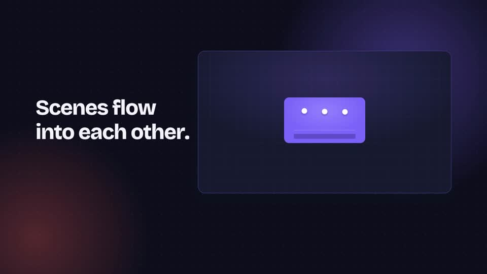
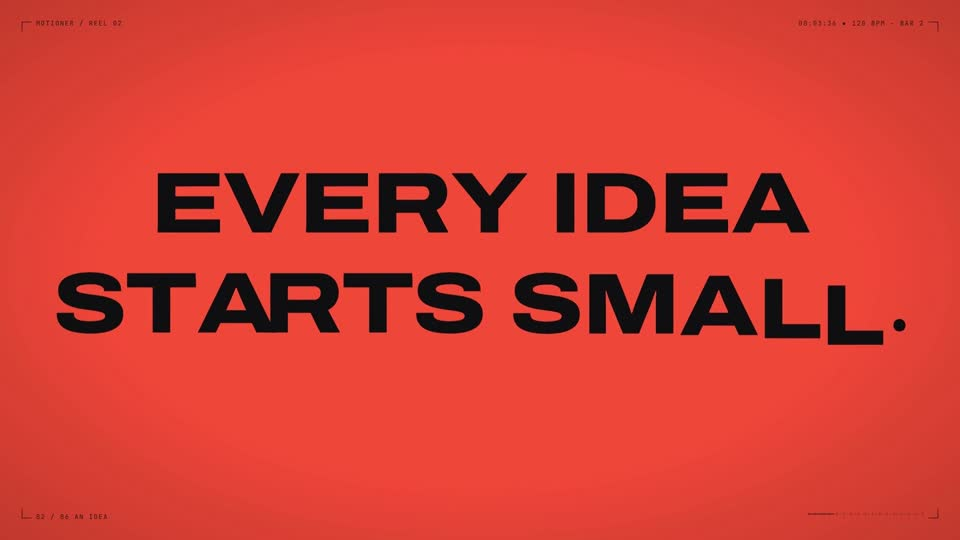
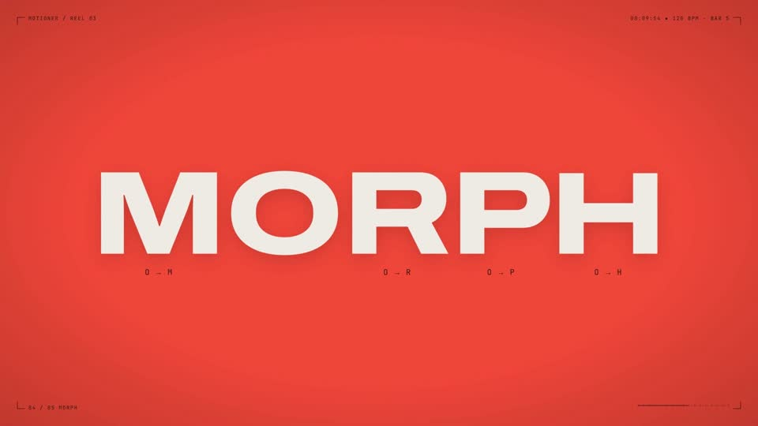
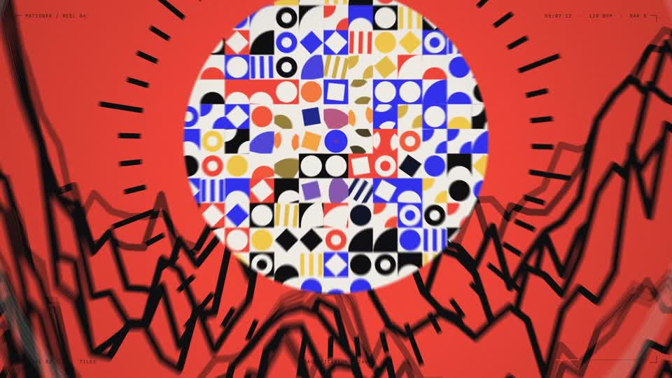
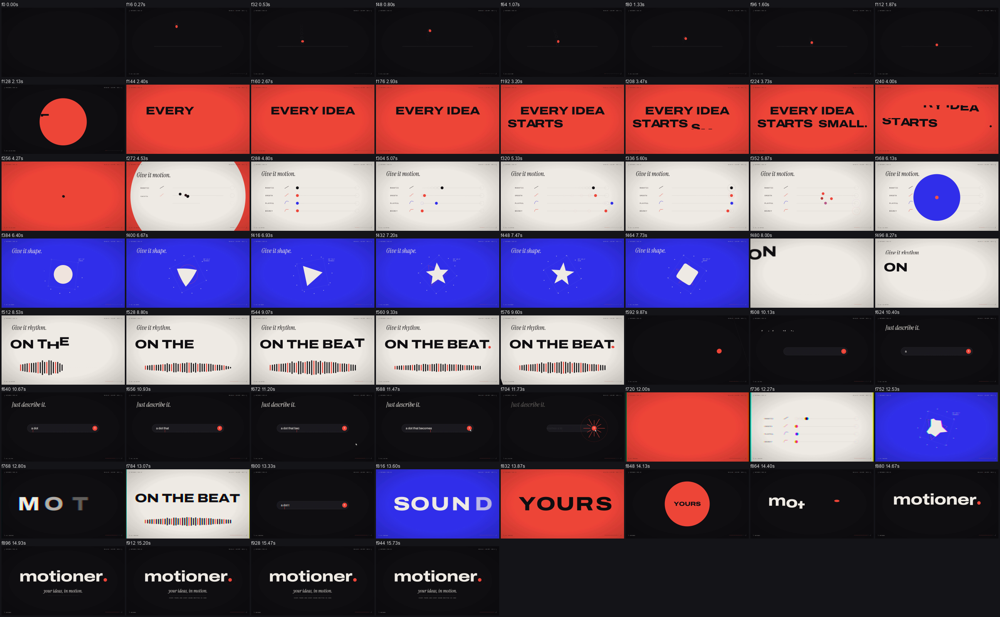

# Motioner

An Agent Skill (Claude Code and Codex) for making motion graphics, reels and product videos at the level of the best films made in code: **a creative concept** (one seed object that transforms through every scene, chapters on the beat, type that acts out its words), **smooth animation**, **seamless morph transitions**, and **music and sound effects written in code and placed on the exact frame**. Remotion is the default tool.

## Films made with it

Every frame and every sound of these four films was written in code by an agent using this skill (click a poster to watch):

| | | |
|---|---|---|
| [](videos/01-motioner-film.mp4) | [](videos/02-motioner-reel02.mp4) | [](videos/03-motioner-reel03.mp4) | [](videos/04-motioner-reel04-dive.mp4) |
|---|---|---|---|
| **01 · Motioner film** (18.6 s): a product story; cards, frames and thumbnails morph into each other | **02 · Reel 02** (16 s): one coral dot becomes every scene; easing rails, shape morphs, beat, montage | **03 · Reel 03** (18 s): everything is inside the word *motioner*; t becomes a timeline, the line a plucked string, the O every letter of MORPH | **04 · Reel 04, the dive** (27.5 s): one continuous zoom through six nested worlds, from the dot of *motioner.* back to the word; x48,600,000 |

Sources: `examples/reel02/`, `examples/reel03/`, `examples/reel04-dive/`.

It is not just advice. It ships:

- **A Remotion kit** (`templates/remotion/`): film chrome (HUD), grain, bursts, camera aperture, lens portal, slat and band wipes, onion-skin trails, kinetic words (rise, drop, bounce, stretch, spin, snap, smear), absorb-into-the-dot, counters, typing, particles, RGB split, squash and stretch; curves by role, hitch-free keyframe tracks, OKLab colour mixing, a `MorphCarrier` that enforces the source/carrier/target contract (no double cards, no ghost text), path and letter morphs, flood, zoom-through and whip-pan transitions, directional motion blur, sharp close-ups, and a build pipeline.
- **Review tools** (`scripts/`) that measure the encoded video and audio:

| Script | What it does |
|---|---|
| `transition_review.py` | Per-transition contact sheets with speed/contrast/sharpness curves and flags: POP, STUTTER, HITCH, FLASH, BLANK, COLORJUMP, GHOST, MUDDY, SOFT, plus local ones on a fine grid: HANDOFF-JUMP (something small jumps on a morph's first/last frame), TELEPORT, JERK (still to full speed in one frame), with pixel positions; lists the fastest frame of every move (where whoosh peaks go) |
| `contact_sheet.py` | Whole-film thumbnails at phone size for a muted review, or `--crop` close-ups of one region frame by frame |
| `synth_score.py` | Writes the soundtrack in code from the film's timeline (and from numbers the picture exports, such as a camera's zoom rate for a Shepard zoom sweep): a tempo-locked music bed (intro, groove, lift, montage, outro, silence before each drop) and one synthesized sound per event (plucks in key, risers, impacts, whooshes shaped by the move's speed, ticks, typing, clicks, glitches, chimes), as a cue sheet for build_mix |
| `sfx_scan.py` | Screens SFX candidates: shape, lead-in, attack, peak, length vs the move, noise; verdict per role; spectrogram cards |
| `beat_grid.py` | Tempo, beats, bars, phrases, accents, breaks and the song's final hit in video frames |
| `build_mix.py` | Cue sheet to mastered WAV: placement by attack/peak/end/peakcut, bar-line music edits, ducking, music kept ~9 LU under the mix, true-peak-safe mastering without crushed transients |
| `sync_check.py` | Finds every cue in the delivered MP4 by cross-correlation and reports early/late in ms and frames |
| `verify_video.py` | Size, fps, exact frame count, codec, pixel format, audio length |

- **Reference docs** (`references/`): a frame-by-frame breakdown of 12 benchmark films, a creative playbook (concept in four lines, beat map, transformation catalogue, type that acts) and the nested-world dive technique, morph recipes and a glitch catalogue (symptom, cause, fix), motion craft, sound design with working asset sources, review loop, Remotion setup, typography, direction defaults.
- **Worked examples**: `examples/reel04-dive/` (27 s continuous zoom through six nested worlds: canvas engine, exact window geometry, a score that follows the camera), `examples/reel03/` (18 s reel built from the letters of one word), `examples/reel02/` (16 s brand reel: seed dot, beat-locked chapters, kinetic type, montage, synthesized score) and `examples/papertrail/` (14.5 s product film using every morph type), each with review sheets and the glitches the tools caught.



## Install

Copy the whole folder (with `references/`, `scripts/`, `templates/`):

| Agent | Personal | Per repository |
|---|---|---|
| Claude Code | `~/.claude/skills/motioner/` | `.claude/skills/motioner/` |
| Codex | `~/.codex/skills/motioner/` | `.agents/skills/motioner/` |

```
git clone https://github.com/Tarquished/motioner ~/.claude/skills/motioner
pip install numpy scipy pillow opencv-python librosa
```

FFmpeg/FFprobe: the scripts use the ones on PATH, `MOTIONER_FFMPEG`/`MOTIONER_FFPROBE`, or the copies Remotion installs in `node_modules/@remotion/compositor-*`.

Invoke with `/motioner` (Claude Code) or `$motioner` (Codex), or let the description trigger it for video work.

## Quick use of the tools

```
python scripts/synth_score.py audio/score.json --out audio/synth
python scripts/transition_review.py out/film.mp4 --plan transitions.json --out out/review
python scripts/sfx_scan.py research/sfx/*.mp3 --role whoosh --motion-frames 36 --fps 60 --cards out/sfx-cards
python scripts/beat_grid.py music.mp3 --fps 60 --png out/grid.png --json out/grid.json
python scripts/build_mix.py audio/cues.json --out public/audio/mix.wav --root .
python scripts/sync_check.py out/film.mp4 public/audio/mix.cues.json --root .
python scripts/verify_video.py out/film.mp4 --width 1080 --height 1920 --fps 60 --frames 873 --codec h264 --pixel-format yuv420p --require-audio
```

## Testing the skill

Run `evals/evals.json` prompts in a fresh session and score the MP4 with `evals/review-scorecard.md`. Eval 2 (fix a glitching film) and the Papertrail example are the regression checks for morph quality and SFX sync; eval 6 and Reel 02 check the creative level against the reference films.

## Limits

The tools measure; they do not have taste. Flags point at frames to look at, and the agent must look. Agents usually cannot hear audio: the skill makes them say so, rely on measurements (shape, alignment, sync, levels) and hand over stems and previews for a human listen.

MIT licence. The repository contains no third-party media: Reel 02's sound is synthesized; Papertrail downloads its sounds from Mixkit and Kenney at setup.
