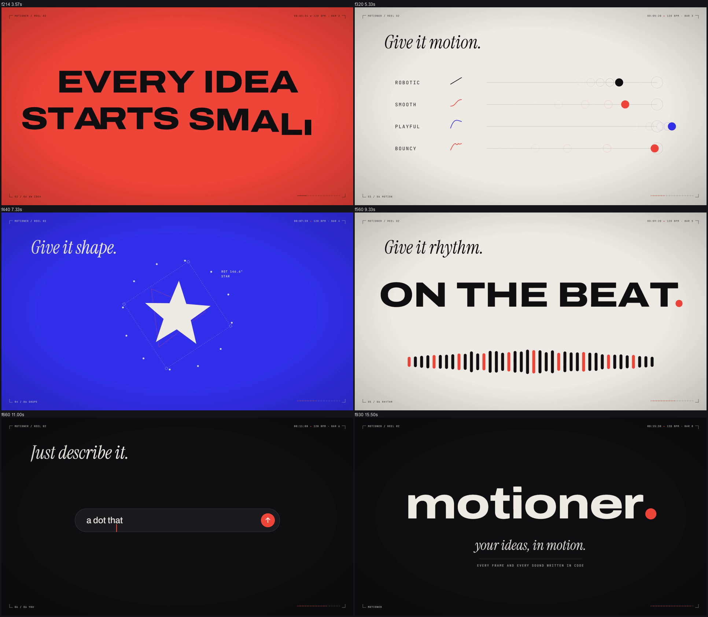
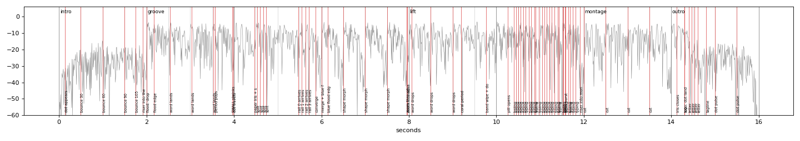

# Example: motioner. reel 02 (16 s, 1920x1080, 60 fps, 120 BPM)

A brand reel built the way the benchmark films are built (see `references/reference-films.md` and `references/creative-playbook.md`): one seed that becomes every scene, chapters on the beat, type that acts out its words, and every sound written in code.


## Concept

- **Seed**: a coral dot.
- **Chapters** (one verb each, all changes on beats): 01 a dot bounces (onion skin and arc chart) → 02 EVERY / IDEA / STARTS / SMALL., one word per beat, SMALL shrinks into its own period → 03 "Give it motion.": the dot splits into four dots racing four easings (robotic, smooth, playful, bouncy) → 04 "Give it shape.": the dots merge, flood blue, the dot grows into a circle that becomes triangle, star, square (ghosts of the previous shape, live rotation readout) → 05 push through the square into "ON THE BEAT." (each word lands on its beat, an equalizer pulses with the kick) → 06 the period flies into a prompt bar as its send button, "a dot that becomes a logo" is typed and sent → montage on half beats (IDEA, the rails, the star, MOTION, the beat, the prompt, SOUND, YOURS) → the last field closes into the dot, which becomes the period of **motioner.**
- **Becomes chain**: dot → flood → words → period → paper iris → four dots → merged dot → blue flood → circle → triangle → star → square → zoom-through → words → period → send button → pill → burst → montage → iris → dot → logo period.
- **Bookend**: the film starts and ends on the same coral dot.
- **Chrome**: crop marks, reel title, chapter label, timecode, BPM and bar, progress ticks (`HudFrame`), film grain (`Grain`).



## Sound

`scripts/make_score.py` writes `audio/score.json` from `src/timeline.json`; `synth_score.py` renders the music (A minor, i-VI-III-VII, intro / groove / lift / montage / outro, 90 ms silence before each drop) and 70+ synthesized cues: a pluck per bounce climbing the chord, riser + impact into the first flood, thuds for words, a stab per shape morph, whooshes on the measured fastest frames, typing per character, click and burst on send, glitches on montage cuts, impact + sub when the dot lands as the logo's period, a chime on the tagline.



Measured on the delivered file: verify PASS; 79/79 cues within 12 ms (median 0.0 ms); -14.4 LUFS, -1.61 dBTP, music 6.9 LU under the mix. (Measured, not heard: listen before you judge the feel.)

## Review notes (what the tools flagged and what was done)

- The prompt pill first appeared as a ring around the send button in one frame (HANDOFF-JUMP at 596): it now grows out of the button's exact circle and collapses back into it.
- The equalizer jumped to full height in one frame on each kick (POP at 570): pulses now have a 2-frame attack.
- The push-through into the square ended with a one-frame jump from blue corners to paper: gentler curve (`ease.inOut`) and a lower max scale so the square covers the frame before the swap.
- Typing and letter ticks were reported 10 frames early/late by sync_check: identical copies nearby were matched. `sync_check.py` now limits the search to less than half the gap to the next copy of the same sound; `synth_score.py` gives repeated sounds three takes.
- Expected flags left in the verdicts: COLORJUMP during floods (a new colour field is the design), POP on the montage's half-beat cuts, BLANK on the first 8 frames (empty frame before the seed appears).
- First draft had small type and small rails lost in the frame; everything was scaled up after comparing the whole-film sheet with the reference sheets.

## Run

Copy `templates/remotion/*.ts*` into `src/motioner/` and `templates/remotion/build.mjs` over `scripts/build.mjs` if you want the latest pipeline (keep `skillScripts`), then:

```
npm install
node scripts/build.mjs      # score -> synth -> mix -> muted render -> mux -> verify -> sync -> transition review
```
