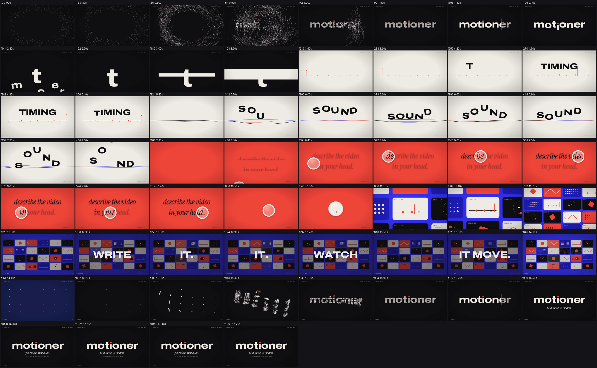
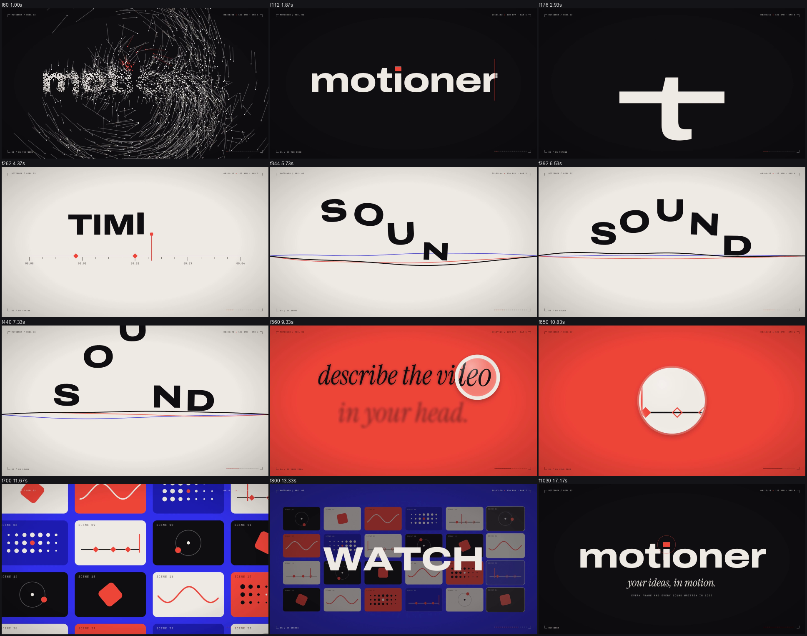
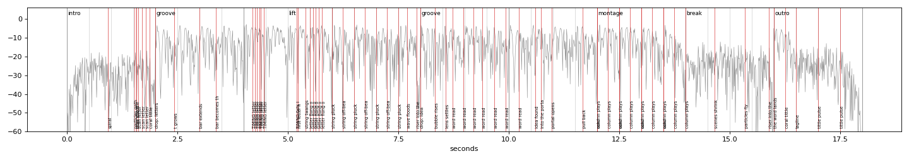

# Example: motioner. reel 03, "everything is inside the word" (18 s, 1920x1080, 60 fps, 120 BPM)

The film opens and closes on the word **motioner**. Every chapter is made from one of its letters.

## Concept

- **Seed**: the word itself. Particles spiral in from a ring and a coral scan line turns them into solid type (the tittle of the i is the brand's coral dot).
- **Chapters** (all changes on beats):
  1. THE WORD (0 to 2 s): particles become *motioner*.
  2. TIMING (2 to 5 s): on the drop every letter falls except the **t**. The t grows, its crossbar stretches across the frame and opens into a paper field; the bar is now a timeline with a playhead, and each letter of TIMING appears exactly when the playhead reaches it.
  3. SOUND (5 to 8 s): the timeline becomes a plucked string. TIMING falls into it and each letter plucks it; SOUND is flung out of it one letter at a time and then rides it like objects on a trampoline (gravity, contact, squash, rotation lagging the slope); every kick plucks the string again and throws the letters; two coloured echoes trail the vibration; the coral wave rises and throws the letters out of the frame.
  4. YOUR IDEA (8 to 11 s): the **o** floats up as a glass lens and reads a blurred sentence, "describe the video in your head"; every word it passes stays sharp. The lens centres and opens as a portal.
  5. SCENES (11 to 14 s): through the portal the camera pulls back from one scene to a wall of 24 living scenes; WRITE IT. / WATCH / IT MOVE. land one per beat while the playing column sweeps.
  6. THE WORD again (14 to 18 s): the scenes shrink to dots, the dots burst into the same particles, and they fly back into *motioner* on beat 32; tagline, footer, coral tittle pulsing.
- **Becomes chain**: particles → word → t → crossbar → band → paper field → timeline → playhead → TIMING → line → plucked string → SOUND → flood → o → lens → portal → scene → wall → dots → particles → word.
- **Bookend**: the same particles and the same scan line open and close the film.

## Sound

Written in code (`scripts/make_score.py` → `synth_score.py`): D minor, i-VI-III-VII; sections intro / groove (drop on beat 4) / lift / groove (drop on beat 16) / montage / break / outro (drop on beat 32), each drop with a 90 ms silence. Cues: swell and whoosh under the particle spiral, riser into the word, ticks on the scan line, impact when the letters fall, whooshes for the t and its bar, one pluck per TIMING letter on the frame the playhead writes it (measured on the draft), a rising pop per SOUND letter flung out of the string, a low string pluck on every kick, riser + whoosh into the flood, a tick per word the lens reads, a chime when the idea is found, whooshes for the portal and the pull-back, thuds for the words on the wall, the particles' whoosh on its measured fastest frame, impact on the landing, a chime on the tagline, pops for the pulses.

Measured on the delivered file: verify PASS; 69/70 cues within 12 ms (the riser into the flood ends 1.2 frames early by cross-correlation, inside the silence gap); -14.1 LUFS, -1.59 dBTP, music 6.8 LU under the mix. (Measured, not heard.)

## Review notes

Client feedback after the first version, and the fixes:
- "The t in the intro is not HD": the big t was a CSS `scale(2.6)` of a layer that also had `will-change: transform`, so Chrome kept its bitmap at 1x and enlarged it. It is now re-laid each frame at its real font size (`BigT`), so every frame is rasterised sharp.
- "The SOUND part feels very stiff": the letters rode three sine waves scrolling at constant speed with rotation copied from the slope, which is mechanical. It was replaced by a physical model: the line is a string with standing modes that decay at different rates, every impact plucks it, and the letters are simulated bodies (gravity, contact, launch, landing squash, rotation that lags the slope). The motion now has cause and effect, anticipation and follow-through; the plucks are scored with low plucks on the kicks and a rising pop per letter flung out.

- The coral tittle was clipped with an inset computed against the wrong box (only a sliver was coral): it is now a rectangle placed from the tittle measured on the canvas raster.
- A few frames with only the wave on screen between TIMING and SOUND: SOUND now starts rising while the last letters of TIMING sink.
- IT MOVE. vanished on one frame (POP at 846): its exit and the dim now ease out over 16 frames.
- Keyframe pops were masked by the TIMING plucks on the same frames: removed, the plucks carry both. `sync_check.py` now treats takes of one synthesized sound as one family when limiting its search.
- Expected flags: POP/HITCH on WATCH / IT MOVE. (words snap in on the beat with no easing, as SNAP type should), a sub-pixel HANDOFF-JUMP at 300 where the ruler line is handed from a div to an SVG path (checked zoomed: invisible).
