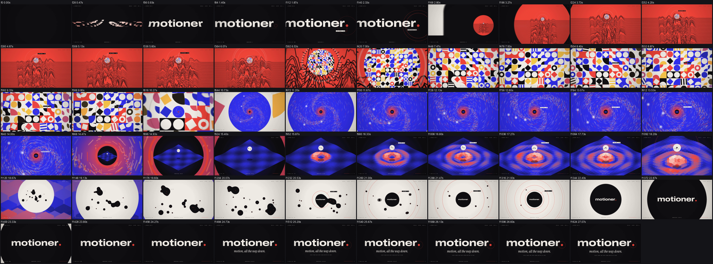
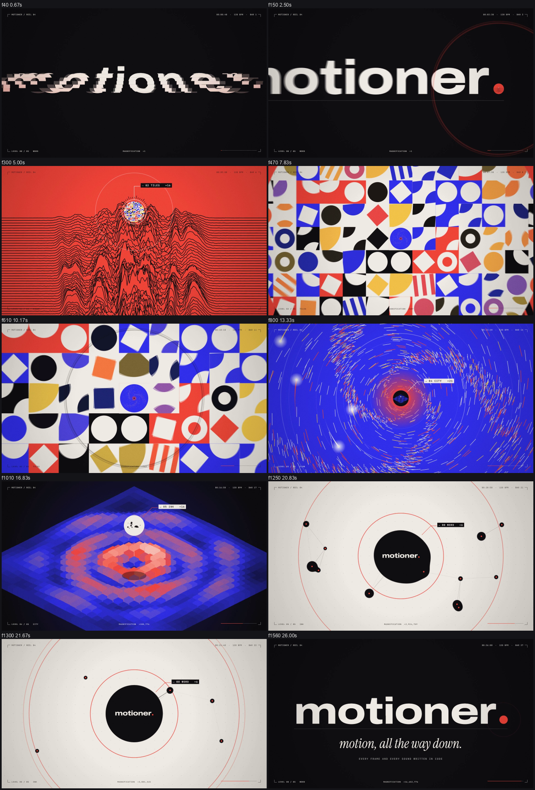
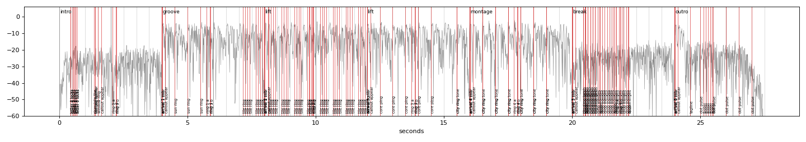

# Example: motioner. reel 04, "motion, all the way down" (27.5 s, 1920x1080, 60 fps, 120 BPM)

One continuous dive with no cut: the camera falls into the dot of the wordmark, and the dot turns out to be a window onto a world; that world has a window onto the next; six worlds in, the last window opens onto the wordmark again. Technique: `references/dive-technique.md`.

## Concept

- **Seed**: the dot of *motioner.*
- **Chapters** (one arrival every 8 beats, each with its own visual language, all in the same four colours):
  00 WORD (slices assemble the word from both sides, centre first; the dot pops) →
  01 RIDGE (a Joy-Division style ridgeline: every row is the spectrum a moment ago; the kick pumps it; the sun is the window) →
  02 TILES (a Bauhaus field whose tiles turn in waves leaving the centre on every beat; the centre tile is the window) →
  03 FLOW (a spiral galaxy of light, four comets, shock rings on the beat, a black core that is the window) →
  04 CITY (an isometric city of columns pushed by rings on every beat; a floating sphere is the window) →
  05 INK (drops of ink drift, string together and are drawn into one drop; the window opens as they merge) →
  06 WORD again, with the tagline "motion, all the way down."
- **Becomes chain**: dot → sun → centre tile → core → sphere → ink drop → dot. Every window's colour is the next world's background.
- **Camera**: one exact zoom about a fixed point per dive (`camera.ts`), eased with `smoothTrack`, temporal supersampling for motion blur (up to 9 sub-frames), a small shake on every landing. Total magnification is shown live in the HUD (x1 to x48,600,000).
- **Bookend**: the film starts on the word and ends on the word (a settled copy of it is what the last window shows, so the landing is exact).
- **Details**: a callout on every window naming the next level and its magnification, telegraph rings 16 frames before every dive, film chrome (crop marks, timecode, BPM, level, magnification, progress), grain and vignette.

## Sound

`scripts/export_events.mjs` bundles `src/events.ts` with esbuild and writes the zoom rate of every dive; `scripts/make_score.py` turns the timeline and those rates into `audio/score.json`; `synth_score.py` renders it (G dorian, Gm-C-F-Bb; a section per world; 90 ms silence before every arrival) and `build_mix.py` masters it. Every dive has a soft air rush plus a swell of the arrival chord that follows the camera's zoom speed exactly and lands on the chord tones (`zoom` cue, `sync: false`; the first version used a Shepard glissando, which was too bright and uncomfortable, so it was replaced), two rising pops for the telegraph rings, and on the arrival an impact, sub, chord and camera shake in step. Every world scores its own events from the same numbers as the picture: the sun rings (plucks on the beat), each tile ring (four plucks per wave, ascending or descending), the core pings, the city's rings (a thud and a bass note), each ink drop as it merges (one note, the pitch climbs with the merged ink) and its ripples, the tagline chime and the dot's pulses.

Measured on the delivered file: verify PASS; 150 of 150 checkable cues within 12 ms (median 0.0 ms, worst 2.5 ms; the 6 zoom sweeps and 4 ripple chimes are diffuse and marked `sync: false`); -14.05 LUFS, -1.8 dBTP, music 7.1 LU under the mix. Measured, not heard.

## Review notes

- Expected flags: GHOST/TELEPORT/JERK along every dive (the whole frame is zooming), BLANK on the first frames (empty frame before the slices arrive), HANDOFF-JUMP on the arrivals at 480 and 960 (the landing shake, by design), JERK/TELEPORT on the tagline and footer entrances.
- Found and fixed while building: streaks that wrapped at the rim of the galaxy drew hundreds of long lines (guard `q0.fr > q.fr`); the ink world's window existed before the drops and they drifted into an existing disc (the window now opens as they merge); the ink edge was blurry when zoomed (edge from the field gradient); the city's beat ring made the centre columns jump in one frame (4-frame attack); seams between the slices of settled letters (a letter is drawn whole once all its slices have arrived); the first callout overlapped the word (the leader goes down); the ripple and zoom cues have no sharp point for cross-correlation (`sync: false`).
- File size: the 60 fps film with grain is 117 MB straight from Remotion (CRF 16); `videos/04-motioner-reel04-dive.mp4` in this repository is re-encoded at CRF 23 (32 MB).

## Run

Copy `templates/remotion/*.ts*` into `src/motioner/` (the files here import `motion.ts` only), `npm install` (esbuild comes with Remotion), then `node scripts/build.mjs`.
