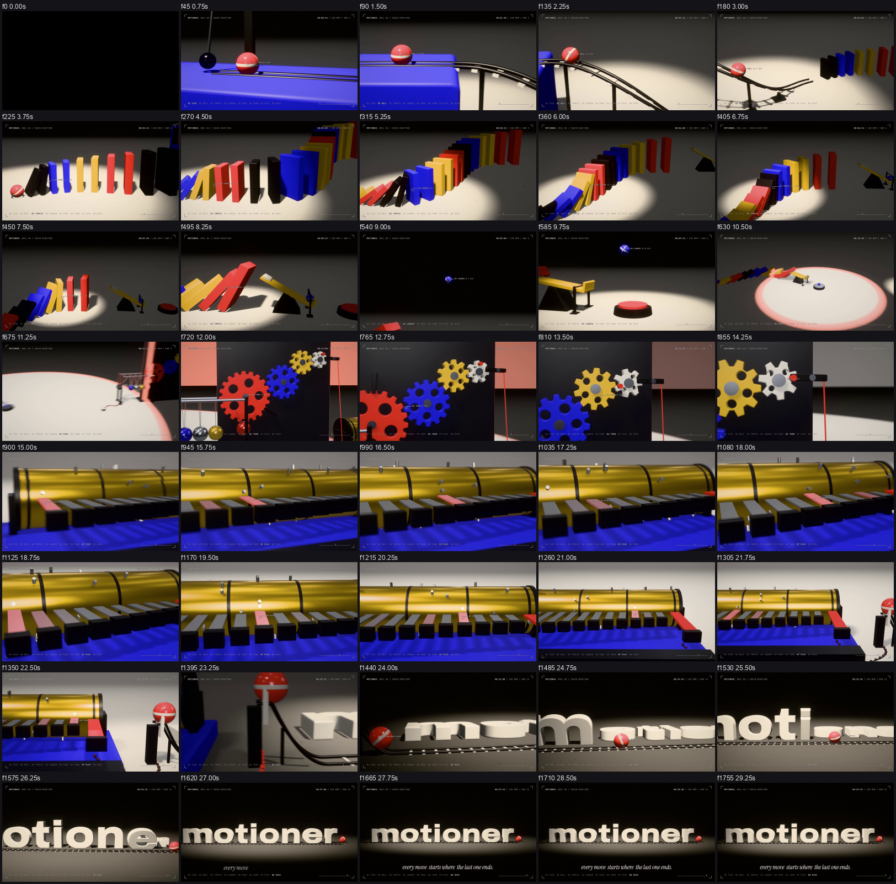
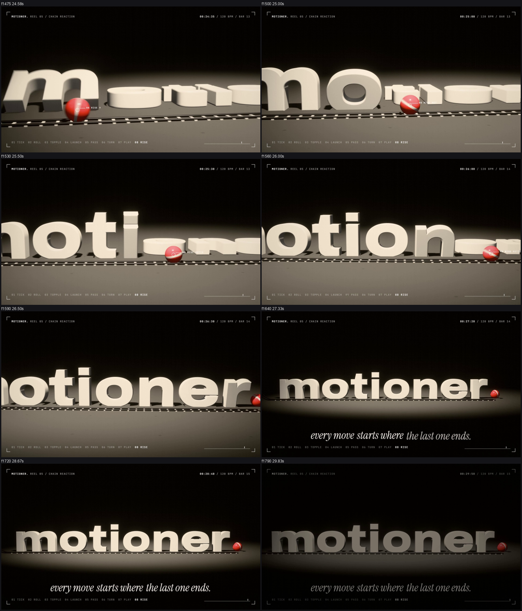

# Example: motioner. reel 05, "chain reaction" (30 s, 1920x1080, 60 fps, 120 BPM)

One continuous camera moves along a 3D tabletop machine. A pendulum taps a bead; the bead rolls down a ladder track whose height is an ease-in-out curve; it strikes a wave of dominoes that grow from 26 to 99 cm; the giant last domino slams a see-saw that throws a ball into the dark; the ball falls on a big button and the light comes on. A wave of light runs out of the button and lights the room; it triggers a Newton's cradle, the cradle turns four gears, the gears lift the brake of a brass music box, the box plays the film's tune (every pin on the eighth-note grid), its last tooth sends a pulse of light to a gate, and the coral bead from the first frame rolls along the eight letters of *motioner* that lie on the floor: each one springs up as it passes. The bead rolls on and stops where the full stop belongs. The room dims to one pool of light. **Every move starts where the last one ends.**

## Concept

- **Archetype**: cause chain (each scene physically triggers the next). Seed: the coral bead, which is also the full stop of the wordmark. Bookend: a pendulum taps the bead in the first second; a bead ends as the period in the last.
- **Chapters** (one visible verb each, shown in the HUD): 01 TICK, 02 ROLL, 03 TOPPLE, 04 LAUNCH, 05 PASS, 06 TURN, 07 PLAY, 08 RISE.
- **Light as structure**: black studio with one spot that follows the action (0 to 10 s) → the button, and a ring of light expands across the floor and lights the room (10 s) → the room dims to a single pool on the word (23 s onward). The ring is real: every sub-frame is rendered in the dark look and in the lit look, and the two are mixed by the ring radius (`world.ts`, `gfx.ts`), so shadows and highlights are correct on both sides of its edge.
- **Scale**: the machine grows. The bead is 1.2 units, the dominoes 2.6 to 10, the gears 10, the letters 6 tall: the camera pulls back with it.
- **Sound**: no music track to follow, the machine is the music. 132 sounds written in code and placed on the frame of the event that makes them (`scripts/make_score.py` reads `audio/events.json`, which `scripts/export_events.mjs` exports from the same TypeScript that draws the picture; instruments in `scripts/synth_machine.py` of the skill).

## How it is built (see `references/chain-technique.md`)

- `src/sim/dominoes.ts`: coupled rotating slabs with contact constraints solved by sequential impulses; the wave, its speed and every contact time come out of the simulation. `sim/cradle.ts`: elastic exchange through five pendulums.
- `src/links/l1..l8`: one file per link. Each link exposes `f0` (its trigger), `f1` (its hand-over), `events`, `build`, `pose(f)` and `focus(f)`; `chain.ts` chains them.
- `src/gfx.ts`: HDR accumulation renderer. Each frame = 32 sub-frames (time inside the shutter, sub-pixel jitter, key light on a disc, sky light over the hemisphere, camera on an aperture disc), averaged in linear float, then bloom, tone map, grain.
- `src/camera.ts`: waypoints written against the moving objects, joined by monotone cubic curves.
- `src/Film.tsx`: HUD and callouts projected from the 3D objects (live speed, note names, domino count, rpm), tagline.
- Letters: real Archivo outlines (`scripts/glyphs.py`, fontTools) extruded with a bevel.

## Measured on the delivered file

verify PASS (1800 frames, 60 fps, h264 yuv420p bt709, AAC); -14.0 LUFS, -2.15 dBTP; 132 cues, 65 verified by cross-correlation (median 0.0 ms, worst 10.0 ms), diffuse (rolls, ticks, sweeps: no sharp point, skipped), 15 overlapping music-box notes and cradle rings whose onsets were checked separately in the delivered audio (0.4 to 0.7 frame, the filter delay). Audio was measured, not heard.

## Review notes

- Expected flags: FLASH/COLORJUMP at the press (the drop), GHOST/TELEPORT along every camera move.
- Found and fixed after the first delivery (both were physics that did not match the picture): the first domino tipped before the bead reached it (the bead arrived 18 frames late and the solver had clamped the floor run; a stronger tap fixes it and the gap is now 0.000 at the frame of contact), and the peg of the last gear went through the lever (the lever is now solved against the peg every step so they never overlap, the last gear is a big slow one so the peg presses the lever exactly once). The first contact also got a real boom (impact, sub, wood slam and a chord, 6 dB above the dominoes).
- Found and fixed while building: the spotlight jumped from the wave head to the ball (POP at the link change: the focus now glides for 18 frames); the pressed button sank under its ring (less travel); the first camera along the music box was static for 8 s (now a slow orbit: macro → high → low from the right → wide); domino wave that ran away (kinematic pushing; replaced by sequential impulses); pendulum quarter period solved so the tap lands on a beat.

## Run

`npm install` (this film has its own engine and does not use `templates/remotion`); `python scripts/glyphs.py` regenerates `src/glyphs.json` (fontTools). Set `MOTIONER_SCRIPTS` to the skill's `scripts` folder, then `node scripts/build.mjs` (renders muted at 32 sub-frames, about 8 minutes on a modern GPU, then muxes the mastered audio). Stills: `node scripts/stills.mjs 640 --sub 16 --scale 0.5`; a look-dev camera: `--cam px,py,pz,lx,ly,lz,fov,shadowR`.
