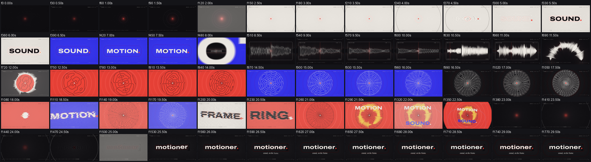

# Example: motioner. reel 06, "resonance" (30 s, 2560x1440, 60 fps, 120 BPM)

One shader draws the whole film. Everything is a distance field: a dot, a word, a box, the film's own waveform. A ring travels along the level sets of a shape, and every transition is a change of weights or of time, so nothing is cut and nothing is faded. **No 3D.**

A coral dot hums in the dark. At the first hit a shock wave turns the room to paper and rings run out of the dot, one per beat. Then time runs backwards: the rings rewind and land on the outline of the word SOUND, the seed becoming its full stop. A wave floods the room blue and SOUND melts, letter by letter, into MOTION, a wave of movement running through the letters. The camera falls into the counter of the O and comes out inside the film's **own soundtrack**: the real waveform of the mix, with a playhead on this very frame. It zooms out to the whole 30 seconds, and the line bends into a ring that opens like a lens onto a **plate of sand**: every note of the arpeggio is a different Chladni pattern, and the room turns coral, blue, ink on the bar lines. The plate accelerates into a montage on half and quarter beats, then everything is on screen at once (rosette, waveform ring, MOTION, SOUND, four palette colours) and an iris closes it all into the dot. Silence, a hum, the rings rewind again, and the wordmark *motioner.* is drawn by them. The seed is its full stop, and it pings once more.

## Concept

- **Archetype**: distance field, "sound made visible" (a fifth one: seed journey, word as world, nested dive, cause chain, distance field). Seed: the coral dot. Bookend: hum in the dark, the dot returns as the period of the wordmark and pings.
- **Chapters** (one verb each, shown in the HUD): 01 HUM, 02 PING, 03 SOUND (rewind), 04 MOTION (melt), 05 FRAME (push-through, the film's waveform), 06 PLATE (sand), 07 TOGETHER (build, montage, collapse), 08 MOTIONER. (rewind onto the wordmark).
- **Becomes chain**: dot, shock ring, rings, rings rewound, SOUND, blue flood, MOTION, counter of the O, scope, whole-film waveform, ring, lens, plate of sand, colour floods, montage, everything together, iris, dot, rewound rings, motioner.
- **Sound as the picture's cause**: a hit every beat moves the field lines by one spacing; every note of the plate's arpeggio is its own nodal pattern; the waveform on screen is measured from the delivered mix.
- **Palette**: ink `#0F0E11`, paper `#EFEBE4`, coral `#FF5436`, blue `#2F3BF4`, yellow `#F6C445` (only in "together"). Archivo (extended, heavy), Instrument Serif italic, JetBrains Mono.

## How it is built (see `references/field-technique.md`)

- `scripts/atlas.py`: real Archivo outlines rendered at 4x, exact distance transform, an RG16F atlas (glyph distance, counter distance) and the word layouts.
- `src/shader.ts`, `src/frame.ts`, `src/engine.ts`: one WebGL2 pass; layers, slots, groups, pulses, field lines, rosette, all read from a float data texture; 12 sub-frames per frame for motion blur; grain and dither.
- `src/scenes.ts`: the film as a pure function of the fractional frame (worlds, transitions, montage, finale); `src/timeline.json`: every event frame, read by the picture, the score and the review plan.
- `scripts/make_score.py` writes the score from the same timeline (ring landings are computed with the picture's own time warp); `synth_epic.py` of the skill renders it; `analyze_audio.py` turns the mastered mix into the waveform the picture draws.
- `src/Film.tsx`: HUD (colour taken from what is under each element), the plate's live note readout, the tagline.

## Measured on the delivered file

verify PASS (2560x1440, 1800 frames, 60 fps, h264 yuv420p bt709, AAC, 30.0 s); **-14.0 LUFS, -2.8 dBTP** (no limiting), the bed 15.8 LU under the mix; 150 cues (94 different sounds), **81 verified by cross-correlation in the delivered file** (median 0.0 ms, worst 3.0 ms; the big hits land on their own frame and the flash that goes with each starts on that same frame); the others are diffuse (rewinds, swells, floods, sand, glides: no sharp point) or bells that ring into each other at 2 to 4 frame steps, which a band-pass onset check could not always separate (`scripts/verify_notes.py`). Silence before every drop: 90 ms at -96 dB. Small-speaker check: everything above 150 Hz alone measures -14.8 LUFS (the mix does not depend on the bass). Transition review: the rewinds and the melt are clean; the flags left are the intended ones (the hits, the floods, the push-through's fastest frames, every montage cut).

## Review notes

- Expected flags: COLORJUMP/POP on every montage cut (each cut is a new palette on a whole frame: a hard cut, all sub-frames of a frame belong to one shot), FLASH/COLORJUMP on the first hit and on the flood to blue, COLORJUMP at the fastest frame of the push-through.
- Found and fixed while building: the coral disc of the plate popped into the ring at the frame it closed (it is now born at the seed and runs out to meet the ring); montage cuts and layer switches were blending two shots inside the shutter (a cut now belongs to one frame); the Chladni lines vanished (`dFdx` inside a loop with a dynamic bound returns zero on ANGLE, the gradient is now analytic); the shader took 30 s to compile (loops unrolled: bounds now come from the data texture); the first mix was 90 % sub-bass and out of phase (reverb on the sub: sends are high-passed, bass below 150 Hz is mono, the hum keeps most of its energy at 2x to 4x the root).
- Audio was measured, not heard.

## Run

`npm install`, `python scripts/atlas.py` (writes `public/atlas.bin`), set `MOTIONER_SCRIPTS` to the skill's `scripts` folder, then `node scripts/build.mjs`: score, mix, waveform, render (about 15 minutes at 12 sub-frames on a modern GPU), mux, verification, sync check, transition review. Stills: `node scripts/stills.mjs 120 300 --scale 0.5`.
